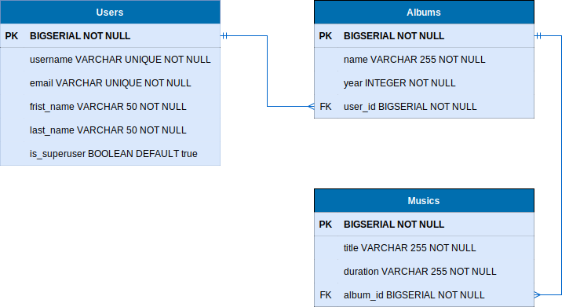

#   **M5 Band-Kamp API**

Essa aplicação é responsável por fornecer ao usuário uma RestAPI desenvolvida em Django, capaz de criar uma interação com um CRUD de usuários completo, bem como com a possibilidade de criação e listagens de Albuns e Músicas.

<br>

___
##  DER - Diagrama da aplicação

<br>




<br>

**É feito uma interação entre 3 tabelas, sendo elas:**

1. `Users`: Tabela de cadastro de usuários. Faz uma relação **1:N** com a tabela *Albums*, onde um usuário pode criar vários albuns, enquanto que um álbum pode pertencer a apenas um usuário;
2.  `Albums`: Tabela para cadastro de álbums. Faz uma relação de **1:N** com a tabela *Songs*, onde um álbum pode conter várias músicas, mas uma música só pode pertencer a um álbum. Tambem faz uma relação de **N:1** com a table *Users*, já citada no item 1;
3.  `Songs`: Tabela para cadastro de músicas. Faz uma relação de **N:1** com a tabela *Albums*, já citada no item 2;
___

##  **Endpoints disponíveis**

Todas as rotas da API compartilham de uma mesma *URL Base*: **http://localhost:8000/api/**

<br>

### **`POST users/`** Criação de um novo usuário

Como esta é apenas uma aplicação experimental, todos os usuários cadastrados serão superuser.

<br>

**Corpo de requisição:**
```json
{
	"username": "franciscoSt",
	"email": "francisco@teste.com",
	"password": "1234Teste",
	"first_name": "Francisco",
	"last_name": "Stenico"
}
```

**Corpo de resposta**

<p><span style="color: #00af4d; font-weight: 700">201 </span><span style="color: #66ffaa">CREATED</span>: Usuário cadastrado com sucesso.</p>

```json
{
	"id": 1,
	"username": "tchescost",
	"email": "francisco@teste.com",
	"first_name": "Francisco",
	"last_name": "Stenico",
	"is_superuser": true
}
```

<p><span style="color: #df3d3d; font-weight: 700">400 </span><span style="color: #ff8888">BAD REQUEST</span>: O username e o email escolhido já estão em uso.</p>

```json
{
	"username": [
		"A user with that username already exists."
	],
	"email": [
		"This field must be unique."
	]
}
```

<p><span style="color: #df3d3d; font-weight: 700">400 </span><span style="color: #ff8888">BAD REQUEST</span>: Campos obrigatórios ausentes.</p>

**Obs:** Em todas as requisições, caso algum campo obrigatório esteja ausente, será retornado um ***400 - BAD REQUEST*** no mesmo modelo abaixo:

```json
{
	"email": [
		"This field is required."
	],
	"password": [
		"This field is required."
	]
}
```

<br>

___

### **`POST users/login`** Login de usuário

<br>

Esta rota retornará por padrão dois tokens de autenticação, um `refresh` token e um `access` token.

<br>

**Corpo da requisição**